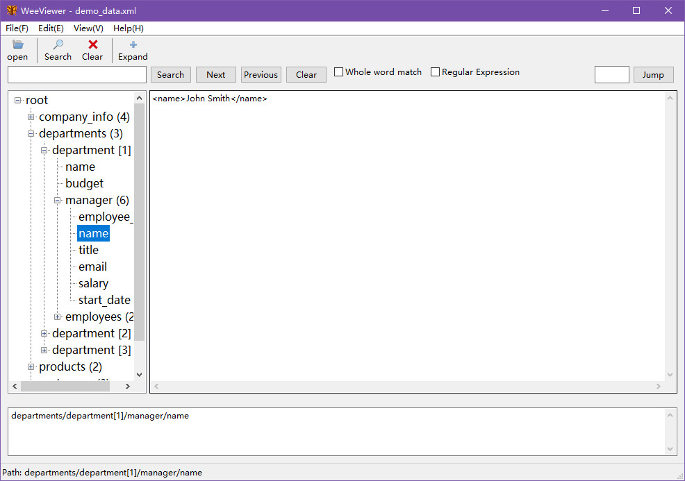

# WeeViewer

> **Data Exploration, Together with You**

WeeViewer is a lightweight JSON/XML data viewer tool that helps quickly browse, search, and locate data structures, making data exploration simple and efficient.



WeeViewer is a lightweight JSON/XML data viewer tool that helps quickly browse, search, and locate data structures, making data exploration simple and efficient.

## Features

- Fast loading and viewing of JSON and XML files
- Tree structure display for easy navigation of complex data structures
- Query path extraction for easy data location
- Powerful search functionality with regular expression support
- Bookmark management for quick marking and access to important nodes
- History tracking for recently opened files and accessed paths
- Syntax highlighting for improved readability
- Dark/Light theme switching
- Persistent configuration for customizing user preferences
- Export functionality supporting multiple formats
- Caching mechanism for improved large file loading performance

## System Requirements

- Python 3.13+
- Windows/Linux/macOS

## Installation

### Running from Source

1. Clone or download this repository
2. Install dependencies:

```bash
pip install wxPython lxml pyperclip reportlab
```

3. Run the program:

```bash
python main.py
```

### Building as Executable

Package with PyInstaller:

```bash
pyinstaller viewer.spec
```

The packaged executable will be located in the `dist` directory.

## Usage

### Basic Operations

1. **Open File**: Click "Open" in the "File" menu to select a JSON or XML file
2. **View Data**: Tree structure on the left shows data hierarchy, right side displays node details
3. **Get Path**: Click a node in the tree to automatically get its query path
4. **Copy Path**: Select a node and click "Copy Path" button to copy the path to clipboard

### Search Features

- Search for node names and values
- Regular expression matching support
- Case-sensitive and whole-word matching options

### Bookmark Features

- Add bookmark: Select a node and click "Add Bookmark"
- Manage bookmarks: View, edit, and delete bookmarks in the bookmark panel
- Bookmark groups: Support for creating different bookmark groups

### Configuration Options

- Window position and size
- Search options
- Theme settings
- History management

## Project Structure

```
WeeViewer/
├── src/
│   └── weeviewer/
│       ├── main.py                      # Main program
│       ├── config_manager.py            # Configuration management
│       ├── search_engine.py             # Search engine
│       ├── syntax_highlighter.py        # Syntax highlighting
│       ├── interaction_improvements.py  # Interaction improvements
│       ├── performance_optimizations.py # Performance optimizations
│       └── __init__.py                  # Package initialization
├── assets/
│   └── app.ico                          # Application icon
├── config/
│   └── viewer_config.json              # User configuration file
├── tests/                              # Test files
├── build/                              # Build files
├── dist/                               # Packaged executables
├── docs/                               # Documentation
├── scripts/                            # Utility scripts
├── viewer.spec                         # PyInstaller packaging configuration
├── build.bat                           # Build script for Windows
├── install_dependencies.bat             # Dependency installation script
├── pytest.ini                          # pytest configuration
├── mypy.ini                            # mypy type checking configuration
├── requirements.txt                    # Python dependencies
├── LICENSE                             # MIT License
└── README.md                           # Project documentation
```

## Dependencies

- wxPython: GUI framework
- lxml: XML parsing
- pyperclip: Clipboard operations
- reportlab: PDF generation

## Development

### Running Tests

```bash
pytest
```

### Type Checking

```bash
mypy .
```

## Version History

### v1.0 (2026-03-14)

- Initial release
- JSON/XML file viewing support
- Tree structure display
- Path query and copy
- Search functionality
- Bookmark management
- History tracking
- Syntax highlighting
- Theme switching

## Contributing

Issues and Pull Requests are welcome!

## License

This project is licensed under the MIT License - see the [LICENSE](LICENSE) file for details

## Contact

- Project homepage: https://github.com/soloverr/WeeViewer

## Acknowledgments

Thanks to all developers who have contributed to this project!